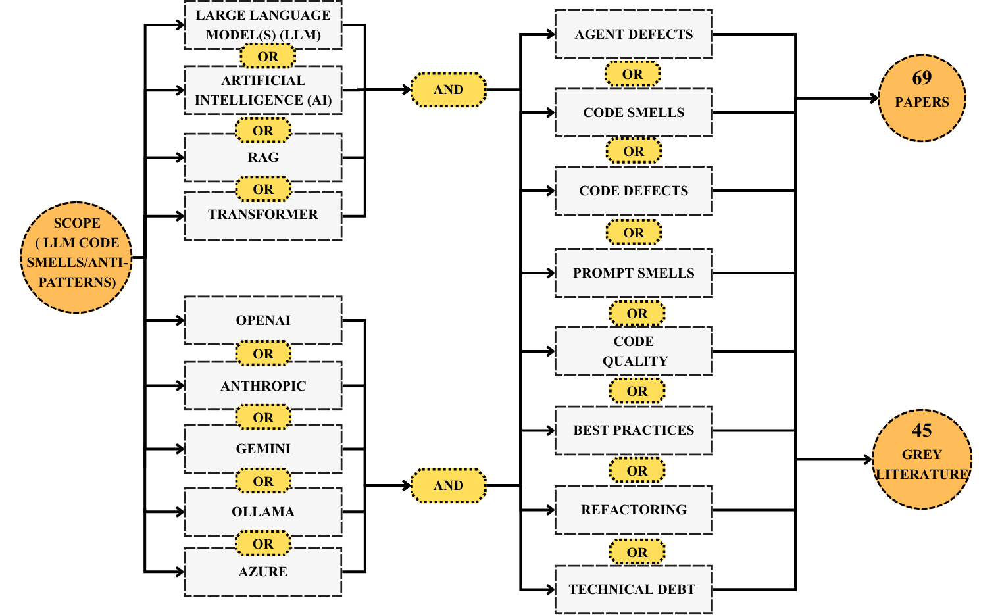
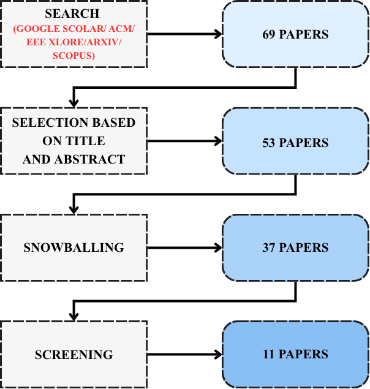
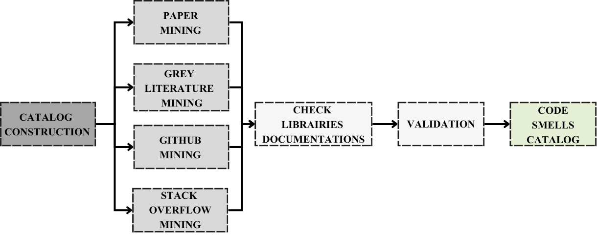

# Methodology: Literature Review & Code-Smell Extraction (LLM Integration)

This document details how we (i) searched and selected the literature on LLM integration code smells & anti-patterns and (ii) constructed the resulting code-smell catalog.

## 1) Scope & Research Questions

We target code-level issues that arise when integrating Large Language Models (LLMs) into software systems (e.g., API misuse, quota handling, structured output, prompt plumbing, reliability, cost/performance risks). Our review asks:

- **RQ1 — Evidence**: What defects, smells, or anti-patterns are reported around LLM/AI integration?
- **RQ2 — Practices**: What mitigation strategies, refactorings, or best practices are suggested?
- **RQ3 — Catalog**: How can these findings be consolidated into a practitioner-oriented code smell catalog?

## 2) Search Strategy

We combined topic, platform/vendor, and software-quality facets using Boolean operators (Figure 1).


*Figure 1 — Query schema used across data sources.*

### 2.1 Data Sources

- **Academic**: Google Scholar, ACM Digital Library, IEEE Xplore, arXiv, Scopus.
- **Grey literature**: provider docs, engineering blogs, cookbooks, issue trackers, Q&A, and technical posts.

### 2.2 Boolean Queries (core template)

We instantiated the diagram into reproducible strings (adapt prefixes/suffixes per portal):

```sql
( "large language model" OR LLM OR "artificial intelligence" OR AI OR RAG )
AND
( "agent defects" OR "code smells" OR "code defects" OR "prompt smells"
  OR "code quality" OR "best practices" OR refactoring OR "technical debt" )
AND
( OpenAI OR Anthropic OR Gemini OR Ollama OR Transformer OR Transformers )
```

We also ran focused variants per platform, smell family, and synonym sets (e.g., anti-pattern, pitfall, bad practice, failure mode).

## 3) Study Selection Workflow

We followed a PRISMA-like funnel (Figure 2).


*Figure 2 — Selection pipeline with running counts from our search.*

### Steps

1. Search & import from all sources; normalize metadata; remove exact duplicates.
2. Title/abstract screening against inclusion/exclusion rules (below).
3. Snowballing (backward/forward) on the surviving set.
4. Full-text screening and eligibility decision.

The diagram records the running tallies (e.g., 69 papers retrieved initially; 53 after title/abstract; 37 after snowballing; 11 included after full-text). In parallel, we curated 45 grey-literature items.

### Inclusion Criteria

- Discusses code-level LLM/AI integration issues (not only model internals).
- Provides concrete symptoms, failure modes, smells/anti-patterns, or actionable practices.
- Peer-reviewed venue or credible technical source (for grey literature).

### Exclusion Criteria

- Pure ML/LLM modeling papers without software integration focus.
- Opinion pieces lacking technical detail or verifiable examples.
- Duplicates/extended abstracts without additional evidence.

## 4) Data Extraction & Coding

For each included item, we extracted:

- Bibliographic info (venue, year, link)
- Context (API/SDK/runtime, deployment setting)
- Defect/smell description (name, intent, when it appears)
- Mechanism (root cause, triggering conditions)
- Effects (reliability, performance, cost, security, reproducibility, maintainability)
- Mitigations (tests, guards, refactorings, patterns)
- Artifacts (code snippets, configs, logs)
- Evidence type (empirical study, industrial report, doc guideline, bug/issue)

Two reviewers independently coded items and reconciled disagreements. We computed Cohen's κ to assess agreement on inclusion and on smell assignments, then resolved via adjudication.

## 5) Building the Code-Smell Catalog

We synthesized the evidence into a catalog construction pipeline (Figure 3).


*Figure 3 — Catalog construction and validation pipeline.*

### Pipeline Stages

1. Paper mining: extract candidate smells, symptoms, and mitigations from included papers.
2. Grey-literature mining: triangulate with provider docs, cookbooks, and engineering posts.
3. GitHub mining: scan representative LLM-integrating repos to observe real-world instances.
4. Stack Overflow mining: collect common failure patterns and developer remedies.
5. Library documentation checks: align smells with official API semantics (limits, timeouts, streaming, JSON, retries).
6. Normalization: merge synonyms; define each smell with Name, Intent, Context, Problem, Consequences, Refactoring/Fix, and Minimal (bad→good) example.
7. Validation: internal walkthroughs and expert feedback on clarity, distinctness, and actionability.
8. Final catalog: stable identifiers and cross-references to evidence and examples.

## 6) Quality Assurance

- Dual screening & coding with κ statistics and reconciliation.
- Traceability: each catalog entry cites one or more source items (paper or grey literature) and, where possible, code evidence.
- Replicability: we preserve the query strings, inclusion/exclusion rules, and versioned datasets (papers list, grey-lit list, mined snippets).

## 7) Threats to Validity

- Search bias: mitigated via multiple portals, synonym expansion, and snowballing.
- Grey-literature credibility: mitigated by favoring provider docs and well-established engineering sources.
- Evolving APIs: vendor limits and SDKs change; we timestamp sources and note model/API versions.
- Construct validity: our smells target code-integration phenomena (not prompt quality alone); definitions underwent expert review.

## 8) Reuse Checklist

 Run the Boolean queries (Section 2.2) on your target portals.  
 Apply the funnel (Figure 2) with the stated criteria.  
 Extract with the schema in Section 4; compute Cohen's κ.  
 Build/validate the catalog via the pipeline in Figure 3.  
 Archive query strings, lists of included items, and examples.

## Figures

- **Figure 1**: Query.png — Search facets and Boolean composition.
- **Figure 2**: Paper_Selection_Process.png — Selection funnel and counts.
- **Figure 3**: Extraction_Methodology.png — Catalog construction pipeline.