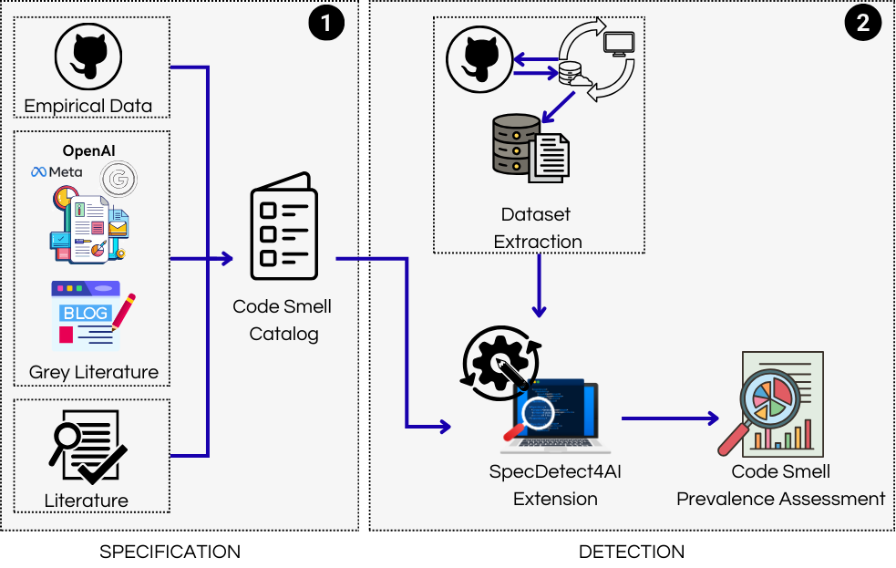

# LLM Code Smells — Replication Package

Companion materials for our study on specifying and detecting **LLM integration code smells**.

## Repository Structure

## 1) `specification/`

This folder contains the **formal specification** of each LLM code smell, including:
- **Name & Intent**
- **Context**
- **Problem**
- **Solution**
- **Effect on Software Quality**
- **Minimal Example (bad → good)**
- **Sources/References**

> Use these files to understand the semantics, rationale, and expected fixes for each smell.

---

## 2) `detection/`

This folder provides:
- **SpecDetect4AI** with the **new detection rules** for LLM integration
- The **dataset** used in our study
- **Extracted metrics** (CSV/Parquet)
- Generated **charts/figures** (PNG)
