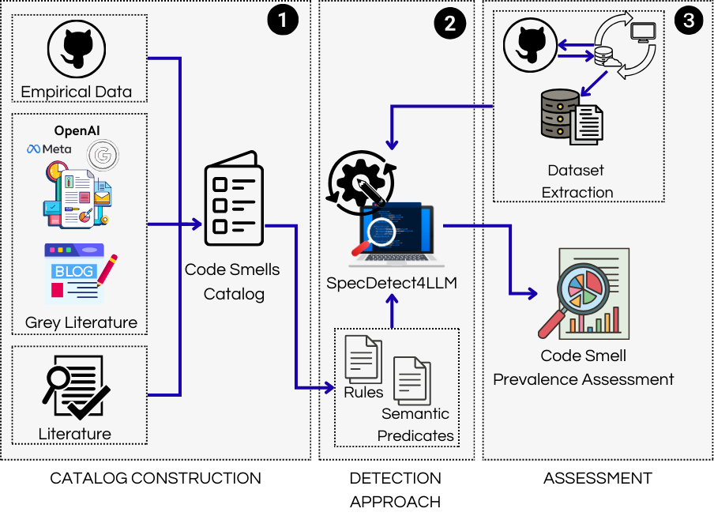

# LLM Code Smells — Replication Package

> Companion materials for **specifying**, **detecting**, and **measuring the prevalence** of *LLM integration code smells*.

---

## How to use: 

- [Command Line](/Detection/docs/usage.md) 
- [Web-app](Detection/docs/docker.md) 

## Quick start

Minimal entry points; detailed steps in the linked docs.

```bash
python -m pip install -r Detection/requirements.txt
python Detection/specDetect4LLM.py --input-dir ./my_project --all
```

For Docker setup and web UI, follow: [Web-app](Detection/docs/docker.md)


## Repository Structure

High-level organization and where to look:

- `Catalog_Construction/`: how the smell catalog was built.
  - `Code_Smells_Description/`: formal smell specs (definition, context, problem, solution, examples, sources).
  - `Literature_Extraction/`: SLR screening data, bibliographic files, and PDFs.
  - `Queries/`: scripts used for literature queries.
- `Detection/`: the detection toolchain (SpecDetect4LLM).
  - `specDetect4LLM.py`: CLI entry point.
  - `test_rules/`: rule implementations and tests; `run_all_tests.sh` runs the suite.
  - `docs/`: CLI usage, rule docs, and contribution notes.
  - `parser/` + `grammar/`: DSL parsing and grammar.
  - `Detection_results/`: precision, prevalence, and timing results.
- `Prevalence/`: datasets, extraction scripts, metrics, and analysis artifacts.
  - `Dataset/`: source datasets.
  - `Extraction_LLM_Files/`: repo selection and file extraction pipeline.
  - `Extracted_Metrics/`: computed metrics and figures.
  - `Precision_Calculation/`: manual analysis and agreement data.
- `web-app/`: Flask web UI for running the analyser.
- `static/`: figures used in documentation.
- `Dockerfile`, `requirements.txt`: runtime dependencies for CLI/web.


## 1) `Catalog_Construction`

This folder contains the **formal specification** of each LLM code smell, including:

- **Smell_Extraction**, all the procedures and values extracted to create the code smell catalog.

and, for each code smell:
- **Name & Intent**
- **Context**
- **Problem**
- **Solution**
- **Effect on Software Quality**
- **Minimal Example (bad → good)**
- **Sources/References**


> Use these files to understand the semantics, rationale, and expected fixes for each code smell.

---

## 2) `Detection`

This folder provides:
- **SpecDetect4LLM**, the extended version of SpecDetect4AI with the **new detection rules** for LLM integration

---

## 3) `Prevalence`

This folder provides:
- The **dataset** used in our study
- **Results** (JSON)
- **Extracted metrics** (CSV/Parquet)
- Generated **charts/figures** (PNG)

---

## 4) Manual Annotation Web App

The web application used for the **manual annotation of LLM Code Smells** during **SpecDetect4LLM's precision and recall study** is available here:

https://github.com/ChL-Z/LLM-code-smells-manual-annotation
